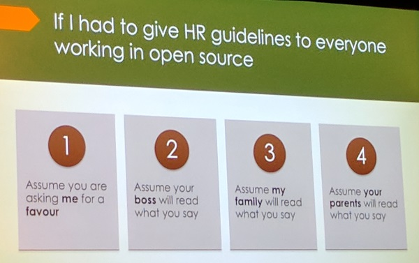

Title: JupyterCon 2017
Date: 2017-08-26 12:34:56
Author: noodlefrenzy
Category: Software
Tags: Jupyter, Python, R, Data Science, Machine Learning
Slug: jupytercon-2017
Status: published
Summary: Report from the first JupyterCon, 2017 in NYC

## JupyterCon 2017

I've just returned from the first JupyterCon, held from August 22-25, 2017 in downtown Manhattan. It was a relatively low-key conference focused on [Jupyter](https://jupyter.org/), starting with tutorials and workshops, and ending with two days of talks in four tracks. [Fernando Perez](https://twitter.com/fperez_org), the inventor of IPython and instigator of this whole Jupyter phenomenon, keynoted the conference with a humbleness and collaborative vision of a vibrant Jupyter-rich future that was infectious. As with some of the best open-source-focused conferences, JupyterCon focused far more on cooperation and sharing learnings and best practices than on advertising. Of course, there were sponsors and booths, but it never felt intrusive.

## Key Takeaways (TL;DR)

For those who don't want to read the full take below, here are my top-line observations:

- Jupyter is continuing to grow in use, especially in the academic space where entire courses are being taught out of Jupyter notebooks
- [JupyterLab](https://github.com/jupyterlab/jupyterlab) (or Jupyter v.next) looks very promising and is almost ready for users to start adopting (EOY17)
- Multi-user managed deployments are coming along (both through [JupyterHub](https://github.com/jupyterhub/jupyterhub) and through PaaS solutions like [Azure Notebooks](https://notebooks.azure.com/))
- Some early careful thoughts about the kernel separation and about protocols have paid dividends, allowing JupyterLab to completely rewrite Jupyter Notebooks while maintaining (almost) full compatibility, allowing light-weight Kernel frameworks like [Xeus](https://github.com/QuantStack/xeus) and some crazy Kernel wrappers.

## Tutorial - Polyglot Notebooks

As a speaker I didn't have permission to do the two-day training, so have no feedback on their quality, but anecdotal evidence from others suggests they were useful. I only went to one tutorial as I had to spend the rest of the day getting my talk cleaned up and all of my code running on my [Data Science VM](https://docs.microsoft.com/en-us/azure/machine-learning/machine-learning-data-science-virtual-machine-overview). Since my team works with such a wide variety of technologies, I often wind up using Python for one project and R for the next. I love Python, don't get me wrong, but I find myself missing dplyr and GGPlot whenever I'm in Pandas/Matplotlib-land (yes, I know about Bokeh/Seaborn/Plotly/Dash), so when I saw [the tutorial](https://conferences.oreilly.com/jupyter/jup-ny/public/schedule/detail/59828) for mixing SQL, Python and R in one Notebook I knew that was where I needed to be.

The tutorial, given by [Laurent Gautier](https://twitter.com/lgautier) (the creator of [rpy2](https://pypi.python.org/pypi/rpy2/)), had some initial setup hiccups getting people up and running (mostly due to people trying to get started without using the provided Docker container), but once those were resolved it was quite interesting. He started by setting up a [SQLite](https://sqlite.org/) instance and showing how to execute SQL queries using [sqlite3](https://docs.python.org/3/library/sqlite3.html) and then [SQLAlchemy](http://www.sqlalchemy.org/), pointing out that while the SQLAlchemy code looks more elegant and certainly more _Pythonic_ than the raw SQL, by using the library you've replaced learning a language (SQL) with learning an API (SQLAlchemy). A valid point, especially given the ubiquity of SQL well beyond the RDBMS world.

Laurent then walked through Pandas and R DataFrames, comparing filtering, aggregation and other methods between Pandas and dplyr. He walked through examples of some reasonably advanced R plotting using [lattice](https://cran.r-project.org/web/packages/lattice/index.html) and [ggplot](http://ggplot2.org/), plotting some interesting earthquake-related data. All of this R work was done using `%%R` magic to run against an R Kernel loaded by `%load_ext rpy2.ipython`. 

Finally, with all of the preliminaries out of the way, we got to the fun part - Python and R together, sharing data and having fun like one big math-nerd play-date. He loaded `rpy2.ipython` as before, but then showed off `importr` and imported some native R packages. These could immediately be accessed just like they were Python:

```python
stats = importr('stats')
tuple(stats.rnorm(5))
```

Laurent then showed off the even more important `rpy2.robjects.lib.dplyr` and `ggplot2`, allowing what looked like straight-up Python dplyr and ggplot code.

```python
result = dplyr.DataFrame(table_join)
              .group_by('something')
              .summarize(n='count(something_else)')
              .arrange('desc(n)')
              .collect()

display(image_png(
ggplot2.ggplot(result.head(10))
       .geom_bar(gg.aes_string(x='factor(something, levels=as.character(something))', y='n'),
                 stat='identity') + 
       ggplot2.scale_x_discrete('something')
)) 
```

## Day One Sessions

### Keynotes

[Fernando Perez](https://twitter.com/fperez_org) and [Andrew Odewahn](https://twitter.com/odewahn) opened the keynotes with, as mentioned previously, a humbleness and a collaborative open spirit that was admirable and infectious. Fernando talked about their new Data Science course at UCBerkeley taught entirely through Jupyter Notebooks in the (private) cloud, allowing them to avoid any student-related setup issues and opening the course to people from sixty different majors.  [Peter Wang](https://twitter.com/pwang) talked about Anaconda's role and helped reinforce Fernando's worry about the health of Jupyter and its community in the future - talking about Continuum's experience as the OSS community around Python evolved and pointing out potential traps for the future, as Jupyter users went from forgiving early adopters to a broader user base.

Rachel Thomas talked about her experience running [fast.ai's](http://www.fast.ai/) [Deep Learning course](http://course.fast.ai/) and how Jupyter helped enable the project, as well as the motivations behind it and some success stories from her students. [Wes McKinney](https://twitter.com/wesmckinn) (of Pandas fame) talked about his efforts on [Arrow](https://arrow.apache.org/) (language-agnostic data frames) and [Demba Ba](https://conferences.oreilly.com/jupyter/jup-ny/public/schedule/detail/62655) discussed their JupyterHub-taught courses at Harvard.

### [JupyterLab](https://conferences.oreilly.com/jupyter/jup-ny/public/schedule/detail/63158)

Bryan Granger, Chris Colbert, and Ian Rose presented the latest progress on JupyterLab. Honestly, I'd never seen JupyterLab and was amazed by how promising it looks. They've managed to fully decouple model from view, allowing a single notebook to be opened to multiple locations and easily docking views in whichever configurations make the most sense. I was also impressed by their live Markdown previewer with the ability to attach a Kernel - letting you Shift+Enter on e.g. a Python cell and execute it in a console window. Finally they showed a collaborative editing scenario using Google Docs, which made me want to try and build a similar scenario using the Microsoft stack. It's looking like it'll be stable enough for users to start using it shortly, and ready for developers to start porting and writing new extensions by the end of the year.

### Domain-Specific Notebook Extensions

I then watched talks on [Graph/Network-based Notebooks](https://conferences.oreilly.com/jupyter/jup-ny/public/schedule/detail/59874) and [Geo-based Notebooks](https://conferences.oreilly.com/jupyter/jup-ny/public/schedule/detail/59861). Both extensions seemed fairly heavyweight and I'm not sure how they will work in the new JupyterLab world, but it was interesting to see these domain-specific adaptations. The Geo-notebook adaptation seemed more useful to me in practice as it included a GeoTile server; it seemed like the Graph extension could probably mostly be accomplished with the Gremlin extension and some creative D3 or Seaborn/GGPlot work.

## Day Two Sessions

### Keynotes

[Fernando Perez](https://twitter.com/fperez_org) and [Andrew Odewahn](https://twitter.com/odewahn) opened the keynotes today as well, and led quickly into a talk by [Jeremy Freeman](https://twitter.com/thefreemanlab) from the [Chan Zuckerberg Initiative](https://chanzuckerberg.com/). He discussed how Jupyter was pivotal in the work they were doing, and how tools can help enable science to happen faster (a pivotal part of their mission), and the challenges ahead in making that happen. [Brett Cannon](https://twitter.com/brettsky) hammered the point home with a talk that, in some respects, boiled down to the OSS version of the Wil Wheaton Rule.



[Lorena Barba](https://twitter.com/LorenaABarba) had a great [talk about reproducibility](https://conferences.oreilly.com/jupyter/jup-ny/public/schedule/detail/60034) and the tension between interactivity and reproducible results. I could say more, but honestly I'd just [recommend watching it](https://twitter.com/LorenaABarba/status/901204006768435200).

### [Kernel Hacking and Following the Protocol](https://conferences.oreilly.com/jupyter/jup-ny/public/schedule/detail/63159)

Paul Ivanov and Matthias Bussonnier had a really interesting talk on the Jupyter infrastructure and protocols. Paul's section on the interaction between the notebook and the kernel was eye-opening with a great sequence diagram that really laid out how they interact. I lost the train a bit, however, when he showed the underlying wire protocol. Matthias talked about the protocol and how Jupyter renders objects to the notebook, showing how easy it was to enable custom rendering. It is _shockingly_ easy! That made me excited for being able to e.g. render DNN topologies in notebooks easily - we'll see how easy it is to do so in practice.

### [Notebook Narratives](https://conferences.oreilly.com/jupyter/jup-ny/public/schedule/detail/60109)

[Patty Ryan](https://twitter.com/SingingData), [Lee Stott](https://twitter.com/lee_stott) and [I](https://twitter.com/noodlefrenzy) gave a talk outlining some of the varied work we've done within the CSE team that involved Jupyter Notebooks. Lee has done a ton of work with academia, enabling large-scale Jupyter deployments and helping people adopt [Azure Notebooks](https://notebooks.azure.com/) - showing off their capability for displaying a "Profile" and letting you publish a set of libraries that outline your entire corpus of work. 

<blockquote class="twitter-tweet" data-lang="en"><p lang="en" dir="ltr">The best part of co-presenting - no-one complains when you take a picture from the stage <a href="https://twitter.com/hashtag/JupyterCon?src=hash">#JupyterCon</a> w/ <a href="https://twitter.com/SingingData">@SingingData</a> and <a href="https://twitter.com/lee_stott">@lee_stott</a> <a href="https://t.co/sdno2WZq2Z">pic.twitter.com/sdno2WZq2Z</a></p>&mdash; Mike Lanzetta (@noodlefrenzy) <a href="https://twitter.com/noodlefrenzy/status/901153580442427392">August 25, 2017</a></blockquote>
<script async src="//platform.twitter.com/widgets.js" charset="utf-8"></script>

Patty discussed her [work with Ernst & Young](https://www.microsoft.com/developerblog/2017/08/07/developing-a-custom-search-engine-for-an-expert-system/) enabling easy discovery of tax policies through a custom Azure Search deployment. She also went into some detail on an [IoT scenario with the Professional Ski Instructors of America](https://www.microsoft.com/developerblog/2017/06/29/iot-sports-sensor-machine-learning-helps-amateurs-up-their-game/) for improving skiers performance by benchmarking them against professional skiers. I discussed a [scenario using object detection](https://www.microsoft.com/developerblog/2017/07/31/using-object-detection-complex-image-classification-scenarios/) with Fast R-CNN for auditing inventory against vendor policies, enabling massive cost savings against the current painful manual process. Jupyter Notebooks are pivotal in these cases for quick iteration, documenting our assumptions and settings inline with the code, and being able to share these with both the partners and the world after our hackfest or short engagement is complete. Of course, all of our work is [open source](https://github.com/CatalystCode/JupyterCon2017) and free (as in beer).

### [Big In Japan](https://conferences.oreilly.com/jupyter/jup-ny/public/schedule/detail/59995)

Yoshi Masatani gave a talk on the solution they've built out in the National Institute of Informatics that, honestly, was pretty mind-blowing. He was obviously struggling to speak English to such a large group and was incredibly soft-spoken (some mic issues didn't help), but the content of his talk was great. I'd say my two favorite take-aways were his "Enhanced Collapsible Headings" which allowed you to collapse notebook sections and run multiple blocks within them with a single click of a "play" button - this would lock successful cells (or _freeze_ them) and mark failing cells as red, and his log summary/truncation functionality which would execute verbose commands and log all output to a file, rendering only the head/tail and errors to the notebook. He had a _lot_ more in his talk, though, so I'd recommend watching it when it comes online.

### [Azure Notebooks Evolved](https://conferences.oreilly.com/jupyter/jup-ny/public/schedule/detail/60152)

Chris Wilcox from the Azure Notebooks team gave a great talk about how Azure Notebooks evolved from prototype to scalable system. I liked that he focused on the journey and their learnings in the process of going from a product team focused on Python and R Tools for Visual Studio to an online service. His insight on the increased impact of flaky tests as you went from a product ship schedule to a service ship schedule was something I hadn't considered before (I come from a services background so flaky tests were always anathema).

### [Xeus, or My OMGWTFBBQ Moment](https://conferences.oreilly.com/jupyter/jup-ny/public/schedule/detail/60038)

The final talk of the conference for me was perhaps the most mind-blowing and interesting, even if it's not directly relevant to my day-to-day work. Sylvain Corlay and Johan Mabile presented [Xeus](https://github.com/QuantStack/xeus), their simple C++ Jupyter Kernel base implementation, allowing people to easily implement their own custom kernels. This in an of itself is an achievement and should allow custom kernels to flourish, but wasn't the most mind-blowing part.

They then gave a great demo of their first custom kernel implementation - a Jupyter Kernel wrapped around [Cling](https://root.cern.ch/cling). Cling is a C++ Interpreter built by the folks at CERN - obviously driven mad contemplating Quantum Chromo-Dynamics. Wrapping Cling in Xeus, they demo'd interpreted C++ inside the Jupyter Notebook showing off polymorphic inheritance and template specialization - quite impressive. They followed this up with a demo of their [XTensor](http://quantstack.net/xtensor) library showing very Numpy-like code written in C++ and running inside Jupyter. It was awesome - in that it was both amazing and terrifying.

They also gave me the quote of the conference: "C++ was never meant to be interpreted". So very true.

## End Notes

I came into this conference a fan of Jupyter, but unaware of either its current power or its future direction. I left incredibly excited for the coming year, and looking forward to the next JupyterCon and the progress it will bring. Thanks Fernando et.al. for such a great tool and conference to go along with it!


