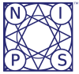

Title: NIPS 2016 Trip Report
Date: 2016-12-13 11:52AM
Author: noodlefrenzy
Category: Software
Tags: ML, Machine Learning, Deep Learning, GAN, Deep RL
Slug: nips-2016-trip-report
Status: draft
Summary: Thoughts and insights from the 2016 NIPS conference 

[NIPS (Neural Information Processing Symposium)](https://nips.cc) is one of the two largest academic conferences in the Machine Learning world (the other being ICML). This year the conference was held in Barcelona, which worked out well for me because I was planning on attending the ML Ascend hackfest the following week in Milan, so I decided to go as an attendee. 

## General Insights

There were a few general insights I had during the conference. First - Google, Facebook, and OpenAI are the stars of the show - from the lanyard giving Google and Facebook pride-of-place, to the dueling Google Research and DeepMind booths, Google seems to be the dominant force. Deep Learning is still the star, but Tensor-based learning methods are generally only increasing in prominence - very little on "traditional" methods. Microsoft's booth had solid attendance, but our relatively confusing story (how many offerings do we have? is our Deep Learning system named CNTK or Cognitive Toolkit?) seemed to prevent "virality" compared to Google's TensorFlow or Facebook's Torch. I talked up CNTK v2 to a few people, but when they went to our booth to get stickers only "Microsoft Cognitive Toolkit" stickers could be found.

## Machine Learning Trends

### Keynote Talks

[Yann LeCun](https://en.wikipedia.org/wiki/Yann_LeCun) gave an interesting keynote on the need for unsupervised learning in general domains as the big open challenge for the future of ML. He called the talk [Predictive Learning](https://drive.google.com/file/d/0BxKBnD5y2M8NREZod0tVdW5FLTQ/view), and described the need for the model to maintain an accurate "world state" in order to begin reasoning in a more general sense.

Drew Purves (former Microsoftie, now at DeepMind) gave a keynote where he talked about the launch of [DeepMind's Lab](https://github.com/deepmind/lab) and more generally talked about the obligation of ML to help solve some of our most pressing environmental problems. He had some really great illustrations in those slides, but I haven't seen him post them yet unfortunately.

[Kyle Cranmer](https://en.wikipedia.org/wiki/Kyle_Cranmer) presented on using ML models in the processing of data at CERN, and some of the unique challenges they face there. They deal with truly big data there, and do a substantial amount of pre-filtering in order to even scope the problem down to something surmountable ([slides](https://figshare.com/articles/NIPS_2016_Keynote_Machine_Learning_Likelihood_Free_Inference_in_Particle_Physics/4291565/1) and [video](https://cds.cern.ch/record/1541893)). With ~1PB of data per second, mountains of processors filter the incoming data to try and trap only "relevant" events (leading to "only" 100GB/s of data). His talk ranged far and wide over many different approaches, so I encourage you to take a look at the slide deck. I'll just call out two interesting developments. First, [CARL](http://diana-hep.org/carl/), a module for "likelihood-free inference" in Python for using likelihood estimation techniques in model-training. Second, a [Jupyter Notebook](https://github.com/lukasheinrich/weinberg-test) for generating high-energy physics simulations on the web. 

### Generative Adversarial Networks

Earlier this year at ICML the big trends were around understanding Deep Neural Nets and exploring Deep Reinforcement Learning. At NIPS Generative Adversarial Networks were the star of the show, with [Yann LeCun](https://en.wikipedia.org/wiki/Yann_LeCun) saying in his keynote that they were the most important development in ML in the last ten to twenty years. Ian Goodfellow gave a great tutorial on GANs (see [slides here](http://www.iangoodfellow.com/slides/2016-12-04-NIPS.pdf)), and the creators of [InfoGAN](https://arxiv.org/abs/1606.03657v1) also gave a great talk.

### Deep Learning and Tensors

In the Deep Learning space one of the star papers was on [Phased LSTMs](https://arxiv.org/abs/1610.09513v1), which added a time-based phase gate to each LSTM memory unit with learned phase offsets, meaning each memory gate only updated when "in phase" and leading to the equivalent of an attention memory network without the complexity. 

In a similar vein to the work using GANs as an input to a loss function for training other networks, my favorite-named paper [Learning to Learn by Gradient Descent by Gradient Descent](https://arxiv.org/abs/1606.04474) had a strong showing at the poster session, although I missed their talk (was in the GAN workshop instead).

There was a great talk in the Tensor workshop on how Deep Networks - and in particular CNNs - create exponential expressiveness with only polynomial parameters. This is due to overlapping of the CNN kernels and pooling. He also outlined in this talk how the choice of pooling creates local areas of attention, and alternate choices of pooling can lean to different network topologies able to detect global structure. Additionally, he pointed out that using e.g. CNNs to learn a single binary classifier limits the amount of information that can be learned from any given training sample, resulting in slower convergence and decreased expressiveness.

The workshops seemed to give some actual in-the-wild implementations a chance to present, with an interesting talk from someone at Sandia on using a DNN to compute better estimates for parameters in dynamical systems - in their case fluid flow dynamics. This led to substantial improvements of the simulation over their current default simplifying assumptions, with only a marginal increase in simulation runtime.

### Other Methods

Variational Inference was big as well, with a great tutorial on it that outlined the method as well as its utility ([slides](http://www.cs.columbia.edu/~blei/talks/2016_NIPS_VI_tutorial.pdf)). They walked through the origin of Variational Inference, from the requirement to approximate the Posterior distribution of a predictive model, through the mean-field method, using topic modeling as a motivating example. They then went through scaling VI via stochastic VI, and went deeper with approximating the ELBO via pathwise estimation and several other methods for scaling out VI. Finally, they finished with a deep-dive into better posterior estimation techniques.

Forecasting and Time-Series were not ignored, but still seem like areas where traditional methods (e.g. ARIMA and its descendents) are holding their own. One tutorial went into deep math around why DL methods could forecast well, but was based on (IMHO) the questionable assumption of "smoothness" in the range [T-S, T]. As someone who did Forecasting for Amazon, I can guarantee that the area around Black Friday is anything but differentiable. 